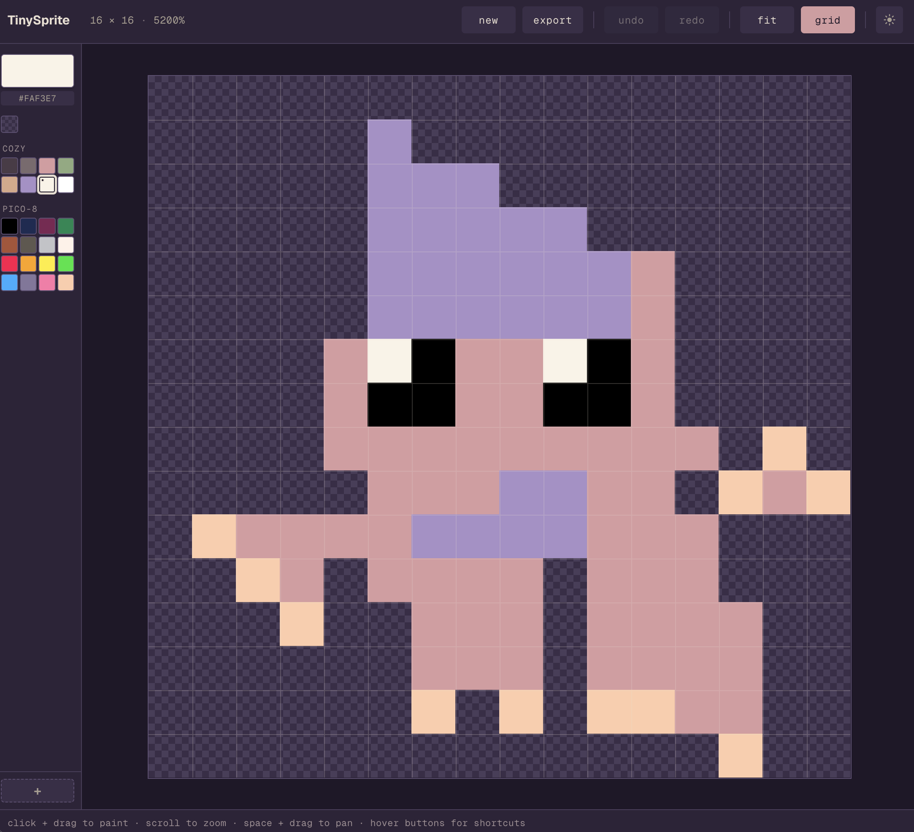

# TinySprite

A tiny, cozy pixel-art editor for the web.



Single-page browser app for drawing small sprites with the keyboard-friendly UX of a desktop editor. No accounts, no server: everything runs client-side and autosaves to your browser. Built with Next.js 16, React 19 and TypeScript.

## Features

- **Crisp pixel rendering** at any zoom level. Single-canvas pipeline with `imageSmoothingEnabled: false`, cursor-anchored zoom, fit-to-viewport on load, viewport clamp so the sprite never escapes.
- **Brush** with Bresenham line interpolation between pointer events. No gaps even on fast strokes.
- **Undo / redo** with up to 100 stroke snapshots, atomic per stroke.
- **Two preset palettes**: a hand-picked cozy pastel set + the classic PICO-8 16-color palette. Plus a transparent swatch that acts as an eraser.
- **Custom color picker** in a modal: SV box, hue slider, hex and RGB inputs, paste from clipboard, click-to-reset comparison.
- **Autosave** to localStorage on every change, debounced. Restore on load with schema validation; bad data falls back to defaults silently.
- **Export** to PNG (1× to 8× scale), SVG (run-length encoded for compact files), JSON (re-importable), and sprite sheet (animation-ready).
- **Theme**: light, dark, follow system. No flash of unstyled theme on load.
- **Hotkeys revealed inline** on hover. Keycap swaps in place of the button label.
- **Responsive**: desktop-first layout with mobile fallback (sidebar moves to bottom, swatches sized for touch).
- **Accessible**: Lighthouse 100 accessibility score, WCAG AA contrast on both themes, full keyboard navigation, custom CSS tooltips (no native `title`).

## Quick start

```bash
pnpm install
pnpm dev
```

Open http://localhost:3000.

## Hotkeys

| Action              | macOS    | Windows / Linux  |
|---------------------|----------|------------------|
| New sprite          | `⌘⌥N`    | `Ctrl+Alt+N`     |
| Export              | `⌘E`     | `Ctrl+E`         |
| Undo                | `⌘Z`     | `Ctrl+Z`         |
| Redo                | `⌘⇧Z`    | `Ctrl+Shift+Z`   |
| Fit to viewport     | `F`      | `F`              |
| Toggle grid         | `G`      | `G`              |

Mouse and trackpad:

- **Click + drag** on the canvas — paint with the active color.
- **Scroll wheel** over the canvas — zoom, anchored to the cursor.
- **Space + drag** — pan. Cursor changes to a hand, and a `PAN` indicator appears in the toolbar.
- **Click a swatch** — set as active color.
- **Hover any button** — the visible label swaps for its keycap.

## Stack

- **Next.js 16** with the App Router and Turbopack
- **React 19** with `useSyncExternalStore` for SSR-safe hydration of platform + theme
- **TypeScript 5** in strict mode
- **Zustand** for editor state (sprite, palettes, history, color picker)
- **CSS Modules** with custom-property tokens for theming; no Tailwind

## Project layout

The interesting bits live under `src/`:

- `lib/sprite/` — pure functions for the sprite data model, pixel buffer manipulation, palettes, serialization
- `lib/export/` — PNG, SVG, JSON, sprite sheet exporters
- `lib/storage/` — localStorage helpers
- `stores/` — Zustand editor store
- `hooks/` — view, hotkeys, theme, platform detection
- `components/editor/` — `Editor`, `Toolbar`, `Sidebar`, `SpriteCanvas`, modals
- `components/ui/` — `Modal`, the generic primitive
- `styles/tokens.css` — design tokens (cozy pastel palette, spacing, radii)

## Scripts

```bash
pnpm dev        # turbopack dev server
pnpm build      # production build
pnpm start      # serve the production build locally
pnpm typecheck  # strict TypeScript check
pnpm lint       # eslint
```

A husky pre-commit hook runs `pnpm build && pnpm exec tsc --noEmit` so broken builds never reach the history.

## How it was built

Documented chapter-by-chapter on a Spanish-language blog where I walk through the actual conversations with Claude Code: idea, canvas, tools and state, persistence, export, polish and deploy. Each chapter has the commits, the tradeoffs and the screenshots.
